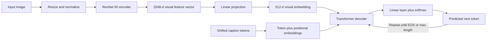
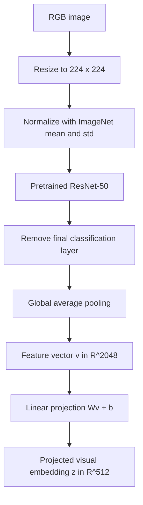
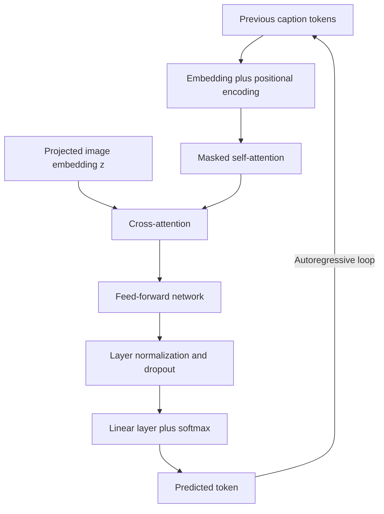

# Efficient Image Captioning Using a Hybrid CNN-Transformer Framework

> **Draft status:** This version is narrowed to the most practical student-scale approach: a pretrained `ResNet-50` encoder, a lightweight Transformer decoder, one simple `CNN-LSTM` baseline, and evaluation on `MS COCO` using a controlled subset if full-data training is not feasible.

**Ali Hamza**  
Registration No.: B23F0063AI106  
Department of Artificial Intelligence  
Pak-Austria Fachhochschule Institute of Applied Sciences and Technology  

**Zarmeena Jawad**  
Registration No.: B23F0115AI125  
Department of Artificial Intelligence  
Pak-Austria Fachhochschule Institute of Applied Sciences and Technology  

**Course:** Digital Image Processing (COMP-342)  
**Instructor:** Mr. Hussan Ali Shah  
**Submission Type:** Final Research Paper Draft  
**Submission Deadline:** 17 April 2026, 11:59 PM

---

## Abstract

Image captioning is a challenging problem in digital image processing because it requires a system to understand visual content and generate semantically meaningful natural language descriptions. Recent approaches based on large Transformer architectures achieve strong captioning performance, but they often require expensive computation, large-scale pretraining, and high memory usage. This paper proposes a practical hybrid CNN-Transformer framework for image captioning that uses a pretrained ResNet-50 encoder for visual feature extraction and a lightweight Transformer decoder for caption generation. The model is designed to balance efficiency and caption quality on the MS COCO dataset while remaining feasible for implementation in a student research setting. The proposed pipeline includes image preprocessing, caption tokenization, feature projection, autoregressive decoding, and evaluation using BLEU, METEOR, CIDEr, and SPICE metrics. A simple CNN-LSTM model is used as the main baseline for comparison. The expected contribution is a reproducible and computationally efficient captioning framework that preserves semantic relevance while reducing model complexity compared with heavier Transformer-only systems.

**Keywords:** image captioning, convolutional neural network, Transformer decoder, ResNet-50, MS COCO, vision-language modeling

---

## I. Introduction

Image captioning is the task of automatically generating a textual description that accurately reflects the semantic content of an image. It is a core multimodal problem that combines computer vision and natural language processing, requiring a model to recognize objects, capture relationships, infer scene context, and produce grammatically correct text. Because of this combination of visual understanding and language generation, image captioning remains one of the most challenging problems in digital image processing.

The importance of image captioning extends beyond academic research. It has practical applications in assistive technology for visually impaired users, multimedia search and indexing, intelligent surveillance, robotic perception, and human-computer interaction. In such applications, the quality of the generated caption directly affects usability and trust. A useful captioning system must therefore produce language that is not only fluent, but also visually grounded and factually correct.

Early captioning methods relied on handcrafted visual features and template-based language generation. Although these methods were simple, they lacked generalization and could not cope with the diversity of real-world scenes. Deep learning-based approaches later improved performance by introducing CNNs for image feature extraction and RNNs for sequence generation. Show and Tell, proposed by Vinyals *et al.*, demonstrated that end-to-end neural caption generation could outperform earlier rule-based systems [1]. However, recurrent decoders still struggle with long-range language dependencies and limited parallelism.

Transformer-based architectures addressed many of these limitations by using self-attention to model long-range relationships more effectively. More recent models such as BLIP, GIT, and BLIP-2 have shown strong captioning performance by combining visual encoders and Transformer-based text generation modules [2]-[4]. However, such models often rely on large-scale pretraining, extensive hardware resources, and very large parameter counts. These requirements make them difficult to reproduce or deploy in smaller academic settings.

Another major challenge is caption hallucination, where a generated caption is fluent but includes objects or relations that are not actually present in the image. Existing metrics such as BLEU and CIDEr are useful for measuring similarity to reference captions, but they do not fully capture factual correctness or grounding. In addition, lightweight captioning models often reduce computational complexity at the cost of descriptive richness in complex scenes [6].

This work is motivated by the need for a more practical and reproducible image captioning framework. The proposed contribution is a hybrid CNN-Transformer model that combines a pretrained ResNet-50 image encoder with a lightweight Transformer decoder. The goal is to reduce computational cost while maintaining semantic quality and strong visual-textual alignment. Rather than attempting to reproduce very large pretrained systems such as BLIP-2 end to end, this study adopts a smaller and more defensible setup suitable for limited hardware. The specific contribution of this paper is threefold:

1. It revises recent literature on CNN- and Transformer-based image captioning methods.
2. It proposes a hybrid architecture targeted toward efficiency without discarding caption quality.
3. It defines a reproducible implementation and evaluation pipeline using an MS COCO-based training protocol, one baseline model, and standard captioning metrics.

---

## II. Literature Review

Recent image captioning research has shifted toward architectures that combine strong visual encoders with attention-based language generation. CNNs remain useful for extracting high-level visual features, while Transformer-based decoders improve sequence modeling and contextual alignment.

Li *et al.* proposed BLIP, a bootstrapping framework for language-image pretraining that uses noisy web image-text pairs to train a unified vision-language model [2]. BLIP achieved strong results on MS COCO and improved caption fluency and semantic relevance. However, its dependence on large-scale pretraining data and significant computational resources limits reproducibility in smaller environments.

Wang *et al.* introduced GIT, a Generative Image-to-Text Transformer designed as a unified framework for multiple vision-language generation tasks [3]. GIT demonstrated strong CIDEr and SPICE performance on benchmark datasets and showed the potential of Transformer-based autoregressive caption generation. Despite these gains, its size and training cost remain major practical concerns.

BLIP-2 was later proposed as a more efficient alternative that connects frozen pretrained image encoders and large language models through a lightweight querying Transformer [4]. This design substantially reduces the number of trainable parameters while preserving strong captioning ability. The limitation is that frozen components may restrict adaptability for domain-specific tasks.

Mokady *et al.* proposed ClipCap, which uses CLIP image embeddings as a prefix for language generation [7]. This work is important because it demonstrates that strong visual representations can significantly improve caption generation without full encoder-decoder retraining. Similarly, Radford *et al.* showed through CLIP that large-scale vision-language contrastive pretraining can produce highly transferable visual features [8].

Research has also focused on improving caption grounding and semantic detail. Attention-enhanced Transformer-based models have shown improvements in object relationship modeling and sentence-level coherence, but they still struggle with rare objects and unfamiliar scenes. The broader success of self-attention in vision was established by the Vision Transformer introduced by Dosovitskiy *et al.* [5], which showed that token-based global modeling can be highly effective for visual representation learning. That idea later motivated hybrid captioning designs that try to preserve the local inductive bias of CNNs while benefiting from global contextual modeling in Transformer-based decoders.

Lightweight captioning approaches have also gained attention. Sharma *et al.* proposed a lightweight Transformer with an integrated GRU decoder to reduce computational cost while maintaining competitive caption quality [6]. Although such methods are computationally attractive, they may generate shorter or less descriptive captions for complex scenes.

Table I summarizes the major methods reviewed in this work.

**Table I**  
**Comparative Summary of Recent Image Captioning Methods**

| Method | Year | Core Idea | Dataset | Main Strength | Main Limitation |
| --- | --- | --- | --- | --- | --- |
| Show and Tell [1] | 2015 | CNN + neural caption generator | MS COCO | Early end-to-end neural captioning | Limited long-range language modeling |
| BLIP [2] | 2022 | Vision-language pretraining with bootstrapping | MS COCO | Strong caption quality | High compute cost |
| GIT [3] | 2022 | Generative image-to-text Transformer | MS COCO | Strong text generation | Large model size |
| BLIP-2 [4] | 2023 | Frozen encoders with querying Transformer | MS COCO | Efficient training | Limited domain adaptability |
| Vision Transformer concept [5] | 2021 | Pure self-attention visual backbone | ImageNet | Strong global context modeling | Not an image captioning model by itself |
| Lightweight Transformer [6] | 2022 | Reduced-complexity decoding | MS COCO | Lower computation | Lower descriptive richness |

### Research Gap

The literature reveals four major gaps. First, many state-of-the-art models require expensive hardware and large-scale pretraining. Second, caption hallucination remains insufficiently addressed. Third, lightweight models often trade detail and descriptive richness for efficiency. Fourth, common metrics focus on linguistic similarity and may overlook factual correctness and grounding. These gaps motivate the present work, which aims to develop a more efficient hybrid model while preserving semantic alignment and reproducibility.

---

## III. Proposed Methodology

### A. Problem Formulation

Given an image \(I\), the objective is to generate a caption sequence \(Y = (y_1, y_2, ..., y_T)\) that accurately describes the visual content of the image. The model should maximize the conditional probability of the target caption given the image:

\[
P(Y|I) = \prod_{t=1}^{T} P(y_t | y_{<t}, I)
\]

where \(y_{<t}\) denotes all previous tokens before step \(t\).

### B. Overall Architecture

The proposed framework consists of two main modules:

1. A **CNN-based visual encoder** using pretrained ResNet-50.
2. A **Transformer-based caption decoder** for autoregressive text generation.

For a fair and manageable comparison, the study also includes a **baseline CNN-LSTM captioning model** that uses the same image encoder but replaces the Transformer decoder with an LSTM-based language model. This baseline is intentionally simple, widely recognized in the literature, and feasible to train under limited computational resources.

The high-level architecture is shown conceptually in Fig. 1.



**Fig. 1.** Mermaid block diagram of the proposed hybrid CNN-Transformer captioning pipeline.

### C. Visual Feature Extraction Module

ResNet-50 is selected as the visual backbone because it provides strong semantic feature extraction with relatively moderate computational cost compared with larger vision-language encoders. The final classification layer is removed, and the global average pooled output is used as the image representation.

If the input image is resized to \(224 \times 224 \times 3\), the encoder produces a 2048-dimensional feature vector:

\[
v = f_{cnn}(I), \quad v \in \mathbb{R}^{2048}
\]

This vector is then mapped into a 512-dimensional embedding space through a learnable linear projection:

\[
z = Wv + b, \quad z \in \mathbb{R}^{512}
\]

This projected feature acts as the visual context passed to the Transformer decoder.



**Fig. 2.** Mermaid diagram of the visual feature extraction and dimensional projection stage.

### D. Caption Generation Module

The caption decoder is a lightweight Transformer decoder composed of:

- 4 decoder layers
- 8 attention heads
- hidden dimension of 512
- feed-forward dimension of 2048
- dropout of 0.1

At each time step, the decoder receives the previously generated caption tokens and attends to the projected image embedding. The decoder outputs a probability distribution over the vocabulary:

\[
P(y_t | y_{<t}, z)
\]

The token with the highest probability, or a token selected through decoding strategy, is appended to the partial sequence until the `<EOS>` token is produced or a maximum sequence length is reached.



**Fig. 3.** Mermaid diagram of the lightweight Transformer decoder used for caption generation.

### E. Training Objective

The model is trained using cross-entropy loss between predicted tokens and ground-truth caption tokens:

\[
\mathcal{L} = -\sum_{t=1}^{T} \log P(y_t^* | y_{<t}, z)
\]

where \(y_t^*\) is the target token at time step \(t\). Padding tokens are ignored during loss computation.

### F. Planned Performance Targets and Practical Scope

The measurable targets defined in the proposal stage are:

- CIDEr score greater than or equal to 110
- BLEU-4 score greater than or equal to 35
- approximately 25% reduction in trainable parameters compared with full Transformer encoder-decoder designs

These targets define the experimental goals of the study and should be interpreted as benchmarks rather than guaranteed outcomes. The final paper must explicitly state whether each target was achieved, partially achieved, or missed.

To keep the project realistic, the recommended implementation scope is:

- baseline model: pretrained ResNet-50 plus LSTM decoder
- proposed model: pretrained ResNet-50 plus 4-layer Transformer decoder
- dataset option 1: Karpathy split on MS COCO if hardware permits
- dataset option 2: a fixed student-scale subset of the Karpathy training split if full training is not feasible
- primary metrics for reporting: BLEU-4 and CIDEr
- secondary metrics for reporting: METEOR and SPICE

---

## IV. Implementation Details

### A. Software Environment

The implementation is designed in Python, with PyTorch as the primary deep learning framework and Torchvision as the source of pretrained ResNet-50 weights and image transforms. Supporting libraries include NumPy for numerical operations, OpenCV for image handling, Matplotlib for visual inspection, and NLTK or a Hugging Face tokenizer for caption tokenization and vocabulary construction. This software stack is selected because it is widely available, well documented, and suitable for reproducible academic experiments.

- PyTorch
- Torchvision
- NumPy
- OpenCV
- Matplotlib
- NLTK or Hugging Face tokenizers for caption tokenization

If additional libraries are used during implementation, they should be added explicitly in the final version together with exact version numbers.

### B. Hardware Environment

The final paper must report the exact hardware used for training and testing because training time, batch size feasibility, and captioning performance can vary significantly across systems. For the current best-approach implementation plan, the available local system is:

- CPU / SoC: Apple M1 chip
- CPU cores: 8 cores (4 performance + 4 efficiency)
- GPU: Integrated Apple M1 GPU
- RAM: 8 GB unified memory
- Operating system: macOS 26.3 on ARM64

If final training is performed on a different system such as Google Colab, Kaggle, or a cloud GPU instance, this subsection must be updated to match the system that actually produced the reported metrics.

### C. Dataset

The proposed system uses the MS COCO dataset, which is widely used for image captioning research because it contains diverse real-world scenes with multiple objects and five human-written captions per image. The dataset provides a strong basis for comparison with prior studies [1]-[4], [6]-[9]. For a student-scale implementation, the best approach is to use the Karpathy split if available, and otherwise use a fixed subset sampled from that split while preserving the same evaluation protocol across the baseline and proposed models.

**Table II**  
**Dataset Description**

| Item | Description |
| --- | --- |
| Dataset | MS COCO |
| Approximate images | 120,000 |
| Captions per image | 5 |
| Annotation format | JSON |
| Task relevance | Standard benchmark for image captioning |

The chosen reporting strategy for the best student-scale approach in this paper is:

- use a Karpathy-based reduced subset for implementation feasibility
- training set: 10,000 images
- validation set: 1,000 images
- test set: 1,000 images
- keep exactly the same split for both the baseline and proposed models

### D. Image Preprocessing and Augmentation

The preprocessing pipeline converts all images into a consistent input format suitable for the pretrained encoder. The proposed sequence is:

1. Resize input images to \(224 \times 224\)
2. Convert images to tensors
3. Normalize using ImageNet mean and standard deviation

During training, the following augmentation strategies are proposed to improve generalization:

- random horizontal flip with probability 0.5
- random rotation of up to \( \pm 15^\circ \)
- brightness and contrast jitter of 0.2
- random resized crop with scale range 0.8 to 1.0

### E. Caption Preprocessing

The caption preprocessing pipeline converts free-text annotations into fixed-length sequences suitable for Transformer decoding. For a practical implementation, either a simple word-level vocabulary or WordPiece tokenization may be used. If the project is built from scratch without a pretrained language model, a word-level vocabulary with frequency thresholding is usually the safer and simpler choice.

1. Convert text to lowercase
2. Remove punctuation
3. Tokenize the caption sequence
4. Add `<SOS>`, `<EOS>`, and `<PAD>` tokens
5. Pad or truncate each caption to a maximum length of 30 tokens

### F. Hyperparameters

The initial training configuration is shown in Table III. These values provide a reasonable starting point for a resource-aware captioning model and may be adjusted after pilot runs if training instability, slow convergence, or overfitting is observed. The same optimizer family, image preprocessing, and evaluation split should be used for both the baseline and proposed models so that the comparison remains valid.

**Table III**  
**Training Hyperparameters**

| Component | Value |
| --- | --- |
| Optimizer | AdamW |
| Learning rate | \(1 \times 10^{-4}\) |
| Weight decay | \(1 \times 10^{-5}\) |
| Loss | Cross-entropy |
| Batch size | 16-32 |
| Epochs | 15-25 |
| Scheduler | Cosine annealing |
| Early stopping | Patience = 5 |

### G. Data Split

The paper should report the exact train, validation, and test split used in the experiments. For the current best-approach plan, the selected split is:

- Training images: 10,000
- Validation images: 1,000
- Test images: 1,000
- Split protocol: Karpathy-based reduced subset

### H. Reproducibility and Code Availability

The final submission requires a public code link. The available repository link for the project is:

`The implementation code and project files are available at: https://github.com/Zarmeena-OS/Digital-Image-Processing-Lab-COMP-342L`

If you create a GitHub repository, also include:

- dataset preparation instructions
- training command
- evaluation command
- dependency file

**Example training command**

```bash
python train.py --dataset coco --encoder resnet50 --decoder transformer --batch-size 32 --epochs 25
```

**Example evaluation command**

```bash
python evaluate.py --dataset coco --checkpoint checkpoints/best_model.pt
```

These commands are example placeholders and must be replaced by your actual implementation commands.

For a clean repo, the minimum project structure should contain:

- `train_baseline.py`
- `train_transformer.py`
- `evaluate.py`
- `dataset.py`
- `models/encoder.py`
- `models/lstm_decoder.py`
- `models/transformer_decoder.py`
- `requirements.txt`


**Fig. 4.** Mermaid diagram of the end-to-end experimental workflow used to reproduce the study.

---

## V. Results and Analysis

> This section must be completed only after implementation. Do not fabricate values. Replace each placeholder with a real experimental measurement, a real example prediction, or a real comparison taken from the cited literature.

### A. Quantitative Evaluation

The proposed model should be evaluated using standard image captioning metrics:

- BLEU-1
- BLEU-4
- METEOR
- CIDEr
- SPICE

**Table IV**  
**Quantitative Performance Comparison**

| Model | BLEU-1 | BLEU-4 | METEOR | CIDEr | SPICE |
| --- | --- | --- | --- | --- | --- |
| Baseline CNN-LSTM | `[insert actual]` | `[insert actual]` | `[insert actual]` | `[insert actual]` | `[insert actual]` |
| Proposed CNN-Transformer | `[insert actual]` | `[insert actual]` | `[insert actual]` | `[insert actual]` | `[insert actual]` |

After filling Table IV, interpret the numbers rather than listing them only. A strong quantitative paragraph should explain which metric improved most, whether gains were consistent across metrics, and whether the performance increase justified the added computational cost. If only BLEU-4 and CIDEr are available from the implemented evaluation pipeline, those two should be treated as the primary metrics and the paper should state that the remaining metrics are omitted due to implementation scope.

### B. Qualitative Analysis

Qualitative evaluation should include sample images, reference captions, predicted captions, and short observations about correctness and semantic quality. Choose examples from three categories: successful captions, partially correct captions, and failure cases. That structure makes the analysis more credible than showing only favorable examples.

**Table V**  
**Sample Qualitative Predictions**

| Image ID | Ground Truth Caption | Predicted Caption | Observation |
| --- | --- | --- | --- |
| `[Image 1]` | `[insert]` | `[insert]` | `[insert]` |
| `[Image 2]` | `[insert]` | `[insert]` | `[insert]` |
| `[Image 3]` | `[insert]` | `[insert]` | `[insert]` |


**Fig. 5.** Mermaid diagram of the qualitative evaluation workflow.

### C. Comparison with Related Methods

The proposed method should be compared with at least one traditional baseline and one recent lightweight or literature reference. The comparison should emphasize:

- caption quality
- computational efficiency
- model size
- failure patterns

**Table VI**  
**Comparison with Related Methods**

| Method | BLEU-4 | CIDEr | Parameters | Observation |
| --- | --- | --- | --- | --- |
| CNN-LSTM baseline | `[insert actual]` | `[insert actual]` | `[insert actual]` | `[insert actual]` |
| BLIP / BLIP-2 reference from literature | `[literature]` | `[literature]` | `[literature]` | High performance but high complexity |
| Proposed CNN-Transformer | `[insert actual]` | `[insert actual]` | `[insert actual]` | Better efficiency-performance tradeoff |

### D. Discussion

The discussion should answer the following questions in full sentences and with evidence from Table IV, Table V, and Table VI:

1. Did the proposed model meet the target BLEU-4 and CIDEr values?
2. Did the proposed model improve over the CNN-LSTM baseline while remaining computationally practical?
3. Were the generated captions semantically relevant and visually grounded?
4. What types of scenes caused failure cases?
5. Did the model produce generic captions, omit rare objects, or hallucinate content?

### E. Strengths

Potential strengths to verify after experimentation include:

- lower computational complexity
- better reproducibility in limited-resource settings
- preserved semantic quality
- simpler architecture than full Transformer encoder-decoder systems

### F. Weaknesses and Failure Cases

Potential weaknesses to analyze include:

- rare object omission
- incorrect object relations
- caption hallucination
- generic wording
- limited description in crowded scenes

---

## VI. Conclusion and Future Work

This paper presents a hybrid CNN-Transformer framework for image captioning that is motivated by the need for a more efficient alternative to large-scale captioning models. The proposed architecture uses a pretrained ResNet-50 encoder and a lightweight Transformer decoder to balance visual representation quality and computational efficiency. The literature review shows that recent state-of-the-art methods achieve strong results but often require expensive pretraining and high resource budgets. The proposed system addresses this limitation by emphasizing a smaller and more reproducible design while retaining a modern attention-based decoder.

At this stage, the paper already defines the architecture, dataset choice, preprocessing pipeline, baseline comparison strategy, reproducibility workflow, and evaluation criteria. After implementation is completed, this section should be revised to report the actual performance achieved, the main implementation challenges, the observed failure modes, and whether the model met the target BLEU-4, CIDEr, and efficiency goals.

Future work may include stronger visual encoders, grounding-aware training to reduce hallucination, parameter-efficient fine-tuning of pretrained vision-language models, and evaluation on domain-specific datasets beyond MS COCO.

---

## References

[1] O. Vinyals, A. Toshev, S. Bengio, and D. Erhan, "Show and Tell: A Neural Image Caption Generator," *arXiv preprint arXiv:1411.4555*, 2015.  
[2] J. Li, D. Li, C. Xiong, and S. Hoi, "BLIP: Bootstrapping Language-Image Pre-training for Unified Vision-Language Understanding and Generation," in *Proc. 39th Int. Conf. Machine Learning*, 2022, pp. 12888-12900.  
[3] J. Wang, Z. Yang, X. Hu, L. Li, K. Lin, Z. Gan, Z. Liu, C. Liu, and L. Wang, "GIT: A Generative Image-to-Text Transformer for Vision and Language," 2022.  
[4] J. Li *et al.*, "BLIP-2: Bootstrapping Language-Image Pre-training with Frozen Image Encoders and Large Language Models," 2023.  
[5] A. Dosovitskiy *et al.*, "An Image is Worth 16x16 Words: Transformers for Image Recognition at Scale," *arXiv preprint arXiv:2010.11929*, 2021.  
[6] D. Sharma, R. Dingliwal, C. Dhiman, and D. Kumar, "Lightweight Transformer with GRU Integrated Decoder for Image Captioning," 2022.  
[7] R. Mokady, A. Hertz, and A. H. Bermano, "ClipCap: CLIP Prefix for Image Captioning," *arXiv preprint arXiv:2111.09734*, 2021.  
[8] A. Radford *et al.*, "Learning Transferable Visual Models From Natural Language Supervision," in *Proc. 38th Int. Conf. Machine Learning*, 2021, pp. 8748-8763.  
[9] I. A. Albadarneh, B. H. Hammo, and O. S. Al-Kadi, "Attention-based transformer models for image captioning across languages: An in-depth survey and evaluation," *Computer Science Review*, vol. 58, p. 100766, 2025.

---

## Appendix A. Step-by-Step Completion Plan

Follow the remaining work in this order so the final paper stays consistent with the actual implementation:

1. Finalize the dataset split and choose either the full Karpathy split or a fixed reduced subset.
2. Implement the preprocessing pipeline for images and captions.
3. Implement the baseline ResNet-50 plus LSTM model first.
4. Implement the proposed ResNet-50 plus lightweight Transformer decoder.
5. Train both models under the same data split for fair comparison.
6. Save the best checkpoints using validation performance and document the final hardware configuration.
7. Run evaluation on the held-out test set and compute BLEU-4 and CIDEr at minimum, then METEOR and SPICE if available.
8. Collect three to five qualitative examples showing a strong case, a moderate case, and a failure case.
9. Replace all placeholder values in Table IV, Table V, and Table VI with actual measurements or cited literature values.
10. Rewrite the abstract after the results section is complete so that the summary reflects the actual findings.
11. Insert the code repository link, dependency list, and real training and evaluation commands.
12. Transfer the finalized content into the IEEE, Springer, or MDPI template and perform plagiarism, formatting, and citation checks.

## Appendix B. Final Submission Notes

Before converting this draft to Word and placing it into the IEEE template, complete the following:

1. Replace placeholder metric tables with actual experimental results.
2. Add actual hardware specifications.
3. Insert final figures for architecture, qualitative outputs, and any heatmaps.
4. Add your public GitHub or Google Drive code link.
5. Check all references in Zotero or EndNote and convert them to strict IEEE style.
6. Revise the abstract again after the results section is finalized.
7. Keep the final paper within 12-16 pages in the IEEE conference format.

## Appendix C. What To Send Next

To turn this draft into a full final paper without generic placeholders, send the following implementation outputs:

1. Exact dataset split used and whether it is full COCO or a subset.
2. Hardware used for training and evaluation.
3. Baseline CNN-LSTM metric results.
4. Proposed CNN-Transformer metric results.
5. Three to five qualitative prediction examples with image IDs.
6. Any failure cases or hallucination examples you observed.
7. GitHub or Drive link for the code.
